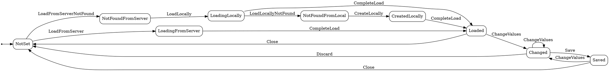

# StateMachinesPOC
 Use Stateless library to write Finite State Machines

## Resources
### State Machine theory:
- https://www.itemis.com/en/yakindu/state-machine/documentation/user-guide/overview_what_are_state_machines
- https://en.wikipedia.org/wiki/Finite-state_machine
### Stateless library: https://github.com/dotnet-state-machine/stateless
### XamBoy example: https://www.xamboy.com/2021/08/17/using-state-machine-in-xamarin-forms-part-1/ 
- [Look also for part 2 and 3 in the same blog](https://www.xamboy.com/category/netlibraries/stateless/)

### Visualization
Trying to use this tools for visualization are hard because the dot graph visualization doesn't really support some of the stateless features and will render in a wrong way
#### Visualize graphs online: https://edotor.net/
#### Dot reference: https://www.graphviz.org/pdf/dotguide.pdf
